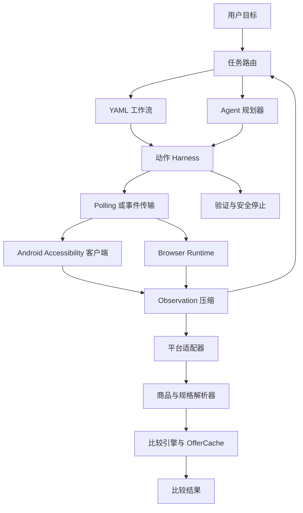

# Mobile Price Agent——移动端价格比较 Agent

一个安全模式的移动端 Computer-Use Agent 原型：通过 Android Accessibility Tree 观察界面，压缩成结构化 Observation，由 Workflow + Agent 决定动作，经 Action Harness grounding 后执行，并对多个商品来源进行规格和价格比较。

当前实现以离线 Fake Device、Mock Shopping App、合成数据和淘宝脱敏 fixture 回放为主。真实设备运行、实时淘宝网页验证、Meituan/JD 适配和真实模型调用均未声称完成。

## 最新项目级验收

2026-08-09 淘宝 fixture 更新后的项目复验评分为 **82/100**，由整改前的 65 分提升。项目已具备本地浏览器真实执行基线和淘宝脱敏结构 fixture 只读回放；后端 **101 个测试**、浏览器 E2E、Android Client 与 Mock App 构建均通过。实时平台和生产交付仍不通过。

详见 [项目全面验收报告](docs/PROJECT_ACCEPTANCE_REPORT.md)。

## 项目简介

目标任务是：搜索同一商品 → 识别规格 → 读取价格/优惠 → 计算可比最终价 → 给出推荐。系统默认 SAFE MODE，订单提交、支付、密码、验证码和安全控制绕过均会触发确定性拦截。

## 核心架构



## Agent 循环

```text
Goal
  → current workflow state + compact observation
  → deterministic workflow or structured Agent decision
  → target grounding
  → safety check
  → device action
  → fresh observation and verification
  → success / retry / replan / safety stop
```

Agent 输出必须通过 Pydantic schema 校验；坐标不是首选目标，系统优先使用 resource ID、node ID、文本语义匹配，最后才使用当前 Observation 的 bounds。

## Workflow + Agent 设计

- 稳定步骤由 YAML Workflow 执行，例如打开搜索、输入关键词、提交搜索。
- 结果选择、规格歧义和异常恢复交给结构化 Agent Planner。
- Workflow 对重试、步骤数、购物车 opt-in 和安全停止设置上限。
- 同一 observation hash + action 连续重复时返回 `REPLAN_REQUIRED`，避免死循环。

## Observation 压缩

原始 Accessibility Tree 会经过归一化、不可见节点清理、空结构节点清理、保守去重和交互节点优先级排序。空文本但 clickable/editable/scrollable 的节点会保留。压缩结果记录节点数、字符数和处理耗时。

## Action Harness 动作执行

目标解析顺序为：

```text
resource ID → node ID → exact text → normalized text → fuzzy match → fresh bounds
```

动作使用 `observation_id` 防止 stale UI；动作结果区分目标缺失、重复目标、动作拒绝、状态未变化、超时、安全阻断和重规划。

## 安全边界

SAFE MODE 默认开启。系统不会提交真实订单、执行支付、输入支付密码、绕过 CAPTCHA 或访问无关隐私数据。安全规则位于确定性代码中，而不是只写在 Prompt 中。详见 [docs/SAFETY.md](docs/SAFETY.md)。

## 环境与启动

```powershell
uv sync
uv run pytest
uv run uvicorn app.main:app --app-dir backend --reload
```

健康检查：`http://127.0.0.1:8000/health`。

传输模式：

```text
TRANSPORT_MODE=polling   # 默认，保留的基线
TRANSPORT_MODE=event     # EventDrivenTransport + WebSocket ingress
```

事件入口为 `/ws/transport`。桌面端默认通过 `BrowserRuntime` 在进程内执行；Android 桥接默认使用 polling：`POST /observations` 上传观察，`GET /devices/{device_id}/actions/next` 获取动作，`POST /devices/{device_id}/action-results` 回传结果。本地缓存默认内存模式，也可以给 `OfferCache` 传入 SQLite 路径启用持久化。

## Mock 演示

Mock E2E 覆盖搜索、Agent 选择商品、选择规格、领取优惠、加入购物车、读取最终价，并在订单确认前安全停止：

```powershell
uv run python scripts/run_mock_e2e.py
```

当前控制性 Mock 运行记录：任务成功，13 步，1 次 FakeLLM 调用，最终价 10.90，安全结果 `SAFETY_STOP`。这些不是真实平台指标。

## 桌面浏览器演示

安装可选浏览器依赖后，运行本地 Mock Web 只读 E2E：

```powershell
uv sync --extra browser
uv run playwright install chromium-headless-shell
uv run python scripts/run_browser_mock.py
```

该流程使用 Playwright Browser Runtime，完成搜索、输入关键词、打开商品、读取 `¥10.90`，然后进入订单确认边界并由确定性 SafetyGuard 返回 `SAFETY_BLOCKED`，不会提交订单。真实网站必须配置允许域名，并由用户手动完成登录。

## 真实平台适配

当前已有通用网页 Adapter、淘宝 Adapter 骨架、Mock Shopping Adapter 和合成 Fixture Adapter。淘宝 Adapter 已回放用户提供的 `iphone17` 商品列表及页面结构 fixture，但尚未声称真实淘宝网页运行成功。真实应用需要：

1. 连接设备并采集经过脱敏的 Accessibility fixtures；
2. 在独立 adapter 中实现页面识别、商品/价格/规格抽取；
3. 用真实 Bad Case 回放验证 selector 和安全边界；
4. 单独报告真实 App 结果，不与 Mock 结果混合。

本仓库没有声称已完成 Meituan、JD 或 Taobao 的真实网页适配；淘宝目前仅完成平台边界与 fixture 回放骨架。

网页只读 fixture 可使用 `scripts/capture_web_fixture.py` 采集；必须显式提供允许域名，输出会限制在项目目录并进行脱敏。详见 [阶段15报告](docs/PHASE_15_REPORT.md)。

## 评估与性能基准

生成阶段13最终评估：

```powershell
uv run python scripts/run_final_evaluation.py
```

报告位于 [evaluation/reports/phase13_final_evaluation.json](evaluation/reports/phase13_final_evaluation.json)。当前报告明确区分：

| 指标 | 实测值 | 数据范围 |
|---|---:|---|
| Tree compression retained ratio mean | 0.5714 | 5 个非空合成 fixture |
| Rule-only parsing accuracy | 1.0 | 8 个 synthetic、未人工复核样本 |
| Hybrid parsing accuracy | 1.0 | 8 个 synthetic、FakeLLM |
| Mock task success rate | 1.0 | 10 次 Mock E2E |
| Mock action success rate | 1.0 | 10 次 Mock E2E |
| Average retries / steps / LLM calls | 0 / 13 / 1 | 10 次 Mock E2E |
| Mock E2E latency mean | 7.8086 ms | 本机 Python Mock Device |
| Warm cache hit rate | 1.0 | 2 个合成来源的第二次比较 |
| Safety stop accuracy | 1.0 | 10 次安全停止场景 |

Polling/event 延迟、原始样本和缓存年龄见 [evaluation/reports/phase12_benchmark.json](evaluation/reports/phase12_benchmark.json)。所有结果是本地离线测量，不代表真实设备、网络或生产吞吐。

## 已知限制

- Git 已有可追溯基线并加入 CI，但本轮整改变更仍需评审后提交，远端 CI 尚无运行记录。
- Android—Backend 双向代码闭环已经接通，但未在物理设备或模拟器上完成运行验证。
- 无物理 Android 设备连接；Android APK 仅完成构建/测试验证。
- 无真实购物 App 运行结果，无真实平台 selector 成功率。
- 解析数据集是 synthetic、未人工复核，不能称为人工标注准确率。
- Event transport 尚未接入真实 Android Accessibility event timing。
- Android 设备桥接当前使用 polling，尚无 Android WebSocket event client。
- Browser Runtime 已在本地 Mock Web 上完成真实 Chromium 执行；真实电商平台 Adapter 尚未完成。
- 浏览器依赖为可选项；没有安装 Playwright/Chromium 时只能运行后端和 fixture 测试。
- SQLite cache 是本地单进程方案，不是分布式缓存。
- 真实模型、真实网络和生产级延迟未测量。

## 目录结构

```text
backend/app/        FastAPI、观察、动作、工作流、Agent、运行时、解析、比较与传输
backend/tests/      单元和离线集成测试
android-client/     Android Accessibility client
mock-shopping-app/  控制性 Mock Shopping App
mock-shopping-web/  控制性 Mock Shopping Web
workflows/          YAML workflow definitions
evaluation/         synthetic datasets and measured reports
docs/               architecture, safety, phase and interview documentation
scripts/             reproducible evaluation and benchmark runners
```

## 文档

- [架构说明](docs/ARCHITECTURE.md)
- [开发指南](docs/DEVELOPMENT.md)
- [阶段状态](docs/PHASE_STATUS.md)
- [最终完成度审计](docs/FINAL_AUDIT.md)
- [面试说明](docs/INTERVIEW_GUIDE.md)
- [中文简历描述](docs/RESUME_BULLETS.md)
- [阶段13报告](docs/PHASE_13_REPORT.md)
- [阶段14报告](docs/PHASE_14_REPORT.md)
- [阶段15报告](docs/PHASE_15_REPORT.md)
- [阶段16报告](docs/PHASE_16_REPORT.md)
- [项目全面验收报告](docs/PROJECT_ACCEPTANCE_REPORT.md)
- [结构化验收结果](evaluation/reports/project_acceptance_2026-08-09.json)
- [安全边界](docs/SAFETY.md)
