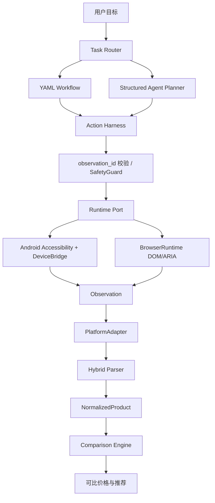

# PriceSight：安全模式跨平台价格比较 Agent

PriceSight 是一个面向 Computer-Use Agent 的工程原型：观察 Android Accessibility Tree 或浏览器 DOM/ARIA，压缩为结构化 Observation，由 Workflow + Agent 规划动作，经 Action Harness 校验和 grounding 后执行，再抽取商品规格与价格并进行跨平台比较。

系统默认 SAFE MODE。它可以搜索、浏览、读取商品信息、选择规格和形成比较结果；到订单确认、支付、密码、验证码或身份验证边界时必须停止。

## 当前验收结论

截至 2026-08-10，项目封板验收综合评分为 **87/100**。该分数沿用原八维权重，不代表生产就绪：封板 CI 已验证 Python 测试、覆盖率、Browser Mock Chromium、淘宝 fixture、跨平台 fixture、淘宝公开网页只读 smoke，以及 Android Emulator + Mock Shopping App External Harness。真实购物 Android App、物理设备、JD/美团 live、线上 LLM 和生产性能仍未验证。

2026-08-11 的定向补强已在本地质量门禁中验证：172 tests passed、branch coverage 85%，并新增 quantity/specification normalization、价格 evidence、Decimal PricingEngine 和 fail-closed abstention。新的结果仍未宣称线上准确率；baseline/final 机器结果见 [evaluation/results](evaluation/results/)。

详细证据见 [封板验收报告](evaluation/reports/project_acceptance_freeze.md)、[机器可读结果](evaluation/reports/project_acceptance_freeze.json) 和 [Metric Contract](evaluation/METRIC_CONTRACT.md)。

## 项目解决的问题

目标流程是：

```text
用户需求 → 搜索商品 → 识别商品/规格/数量 → 读取展示价和优惠 → 计算有效单位价 → 返回比较结果
```

难点不是简单抓取数字，而是处理移动界面和网页的部分可观测性、旧页面动作、规格/数量歧义、不同平台页面结构以及下单安全边界。

## 核心架构



核心代码按职责分离：`backend/app/runtime` 提供 Runtime Port、BrowserRuntime 和设备抽象；`backend/app/observation` 负责 Observation；`backend/app/platform` 负责 Adapter；`backend/app/parser` 负责规则与结构化 LLM fallback；`backend/app/workflow`、`backend/app/agent` 和 `backend/app/task` 负责任务执行；`backend/app/transport` 负责设备会话与 polling/event transport。

## Agent Workflow

稳定步骤优先使用 YAML Workflow，例如打开搜索、输入关键词、提交搜索和返回；商品选择、规格歧义和异常恢复才进入结构化 Agent Planner。动作执行顺序是：

```text
当前目标/状态
  → compact Observation
  → Workflow 或 Agent decision
  → target grounding
  → SafetyGuard
  → Runtime action
  → fresh Observation + verification
  → 成功、有限重试、重规划或安全停止
```

Workflow 和 Agent 都受步骤、重试、LLM 调用和安全边界约束；同一状态重复动作会要求重新观察或重规划。

## Observation Tree 剪枝

Android 侧把 Accessibility 节点转换为 framework-neutral DTO；后端/浏览器侧使用统一 Observation 模型。压缩流程包括归一化、不可见节点清理、空结构节点清理、保守去重、交互节点优先级排序和紧凑序列化。

空文本节点如果仍然 clickable、editable、scrollable、有有效 bounds 或包含有意义的子节点，不会被误删。每次压缩可以记录原始节点数、压缩节点数、保留比例、序列化字符数和处理耗时，用于评估上下文大小。

## Hybrid Parser

解析管线为：

```text
normalize → candidate extraction → deterministic parse
→ ambiguity detection → optional structured LLM
→ Pydantic schema validation → confidence/reason
```

数字、数量、单位、规格、明确价格、套装和简单促销优先由规则处理；组合关系、标题语义歧义和不完整信息才调用 LLM。LLM 输出必须通过结构化 schema，解析失败 fail closed。结果会记录 `parser_source`、`confidence` 和 `reason_code`。

当前冻结 Evaluation 共 96 条，40 条 `HUMAN_VERIFIED_ELIGIBLE`，固定 DEV/HOLDOUT 为 32/8，provenance audit 为 40/40。source 均为 `SOURCE_RECREATED_FROM_EXISTING_ANNOTATION`，不是原始网页 capture。`EXACT_CORE_V1` Human 为 5/40，`EXACT_STRICT_V2` 为 2/40，HOLDOUT 两者均为 0/8；这些是人工复核离线回放指标，不是线上总体准确率。

## Browser / Android Runtime

### BrowserRuntime

BrowserRuntime 使用 Playwright Chromium 将 DOM/ARIA 和语义节点转换为 Observation，并复用 `ActionDevice`/Runtime Port 约束。启动时固定 allowlist，动作优先使用 locator、ARIA/文本和当前页面 bounds，离开允许域名或遇到安全页面时停止。

已验证：本地 Mock Web Chromium E2E 搜索、输入、打开商品、读取 `¥10.90`，进入订单确认边界后返回 `SAFETY_BLOCKED`，未提交订单。阶段8还完成了一次淘宝公开搜索页只读 smoke：真实页面访问成功，生成 Observation，抽取 140 个商品链接和 45 个展示价格，无外部副作用；证据等级为 `LIVE_READONLY_VERIFIED`。它只证明该次公开页面只读链路，不证明登录态、稳定性或下单能力。

### Android Runtime / DeviceBridge

Android `PriceSightAccessibilityService` 采集树，`AndroidActionExecutor` 执行点击、输入、滚动、返回和停止等动作，`DeviceBridgeClient` 通过 polling 上传 Observation、获取动作并回传结果。后端在入队和下发阶段都校验 `observation_id`；action/command id、租约、有限重试和生命周期代码已存在。

Android Emulator + Mock Shopping App External Harness 已验证 Observation、动作执行、结果回传、旧观察拒绝、安全阻断和完整动作矩阵，状态为 `MOCK_RUNTIME_VERIFIED`。这不等价于真实淘宝/JD/美团 Android App 或物理设备验证；Android assembleDebug 仍单独标记为 `BUILD_ONLY`。

## Comparison

Comparison Engine 只对身份、规格、数量和 confidence 满足比较条件的商品计算 effective unit price；不把页面上孤立的展示数字直接排序。effective price 的确定性优惠契约见 [Metric Contract](evaluation/METRIC_CONTRACT.md)。

## Platform Adapter

统一链路保持为：

```text
Runtime → Observation → PlatformAdapter → NormalizedProduct → Comparison Engine / Agent
```

`PlatformAdapter`/`BasePlatformAdapter` 约束页面识别、商品抽取、详情抽取、标准化和安全边界。Taobao Adapter 已支持结构化页面 fixture 和公开只读 smoke；JD、Meituan、Mock Adapter 使用相同契约完成 fixture/mock 验证。比较基于 `effective unit price`、数量、规格和 confidence，不直接比较页面上的孤立数字。JD/美团实时页面仍未验证。

## Safety Boundary

安全规则在确定性代码中，而不是只放在 Prompt：

- 订单提交、支付、支付密码、验证码、身份验证和安全控制绕过会触发 `SafetyDecision.STOP`。
- Action Executor、BrowserRuntime 和 Android bridge 都会做安全拦截。
- 动作必须绑定当前 Observation；旧 Observation 会返回 `STALE_OBSERVATION`，不会继续执行。
- Mock E2E 已证明订单确认按钮返回 `SAFETY_BLOCKED`，且 `order_was_submitted=false`。

详见 [安全说明](docs/SAFETY.md)。

## Evaluation Methodology 与一键验证

Python 环境使用 Python 3.12、FastAPI、Pydantic、pytest 和 uv。最小质量门禁为：

```powershell
uv run python scripts/run_quality_gate.py
```

它会执行 Ruff、mypy、compileall、pre-commit、全量 pytest 和 80% branch coverage 门槛。最终封板验收还使用：

```powershell
uv run python scripts/run_browser_mock.py
uv run python scripts/run_taobao_fixture_replay.py
uv run python scripts/run_evaluation_v2.py
uv run pytest backend/tests/test_multi_platform_adapters.py backend/tests/test_comparison.py backend/tests/test_taobao_adapter.py backend/tests/test_web_adapter.py -q
uv run --project backend python scripts/build_final_dataset_manifest.py
uv run --project backend python scripts/build_final_evaluation_report.py
uv run --project backend python scripts/build_project_acceptance_freeze.py
```

Evaluation 不以 accuracy 营销为目标：它保留 synthetic/fixture regression，区分 HUMAN_OFFLINE_EVALUATION，使用 provenance audit、固定 DEV/HOLDOUT、Bad Case taxonomy 和 numerator/denominator。EXACT_CORE_V1 与 EXACT_STRICT_V2 的定义固定在 [METRIC_CONTRACT.md](evaluation/METRIC_CONTRACT.md)。

浏览器依赖是可选项，且不应将 Mock 结果写成真实平台结果。Android 本地命令为：

```powershell
F:\newinstall\gradle-9.7.0-bin\gradle-9.7.0\bin\gradle.bat test --offline --no-daemon --console=plain
F:\newinstall\gradle-9.7.0-bin\gradle-9.7.0\bin\gradle.bat assembleDebug --offline --no-daemon --console=plain
```

完整验收状态、numerator/denominator、阻断原因和评分见 [最终验收](docs/07-final-acceptance.md)；机器结果见 [project_acceptance_freeze.json](evaluation/reports/project_acceptance_freeze.json)。

## Demo

- Python Mock Shopping：`uv run python scripts/run_mock_e2e.py`
- Browser Mock Chromium：`uv run python scripts/run_browser_mock.py`
- 淘宝脱敏 fixture：`uv run python scripts/run_taobao_fixture_replay.py`
- 淘宝公开页面只读 smoke：`uv run python scripts/run_taobao_readonly.py`；只允许读取，不登录、不点击、不输入、不加购、不下单、不支付。

## Quick Start

```powershell
uv run --project backend pytest -q
uv run pre-commit run --all-files
```

## 已知限制

- Android Mock Emulator Runtime 已达到 `MOCK_RUNTIME_VERIFIED`；真实购物 Android App 和物理设备仍为 `NOT_VERIFIED`。
- Android `lintDebug` 当前离线缺少 `com.android.tools.lint:lint-gradle:31.5.2`；远端 GitHub Actions 尚无执行记录。
- 淘宝 live smoke 只覆盖一次公开搜索页只读访问；JD/美团没有 live smoke。
- Evaluation 有 40 条人工复核 reconstructed anonymized samples，但 HOLDOUT exact 为 0/8，generalization 为 `LIMITED`；FakeLLM 不代表线上模型。
- SQLite SessionStore 是本地单体持久化，不是分布式故障转移方案；真实断网重连、多进程 failover 未验证。
- 真实购物 App、真实支付、真实订单、生产吞吐和长期价格稳定性均未测试。

## 目录与文档

```text
backend/app/        后端运行时、Observation、Action、Workflow、Agent、Parser、Adapter、Transport
backend/tests/      单元和离线集成测试
android-client/     Android Accessibility client
mock-shopping-app/  Mock Android App
mock-shopping-web/  Mock Browser App
evaluation/         数据集、runner 和验收报告
docs/interview/     面试说明
```

- [文档索引](docs/README.md)
- [项目概览](docs/01-project-overview.md)
- [架构说明](docs/ARCHITECTURE.md)
- [开发历史](docs/03-development-history.md)
- [测试与工程质量](docs/04-testing-and-quality.md)
- [AI、Parser 与 Evaluation](docs/05-ai-evaluation.md)
- [环境与复现](docs/06-environment-and-setup.md)
- [最终验收](docs/07-final-acceptance.md)
- [阶段状态](docs/PHASE_STATUS.md)
- [安全说明](docs/SAFETY.md)
- [冻结数据 manifest](evaluation/reports/final_dataset_manifest.json)
- [Metric Contract](evaluation/METRIC_CONTRACT.md)
- [面试材料入口](docs/08-interview-materials.md)
